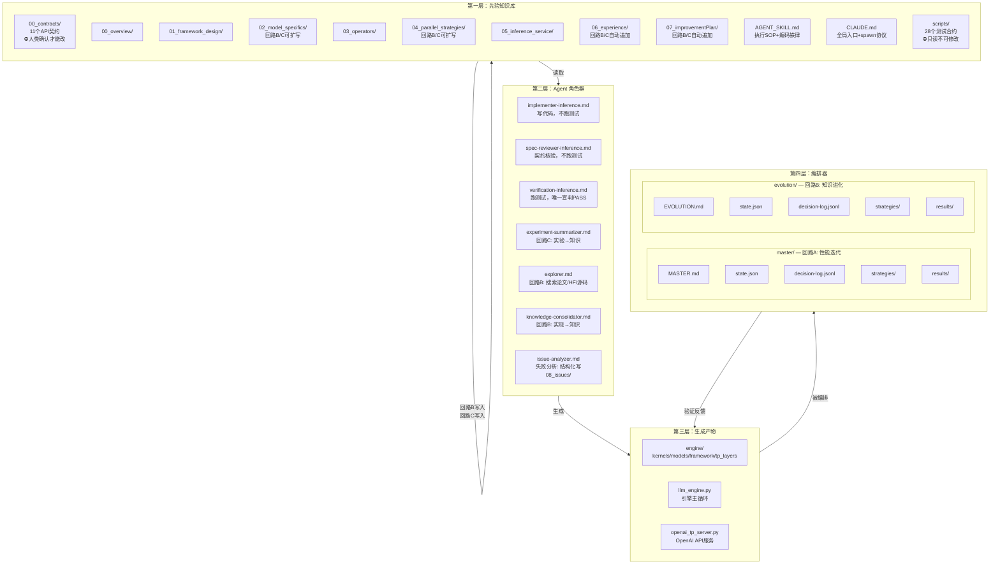
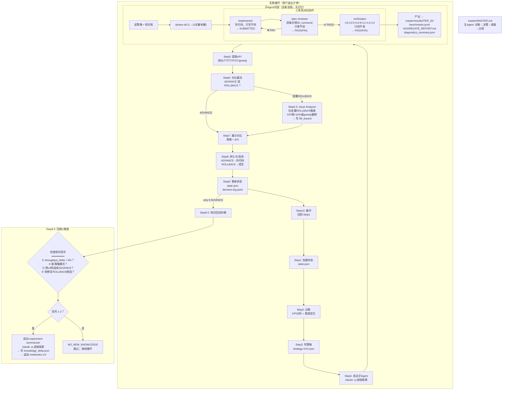
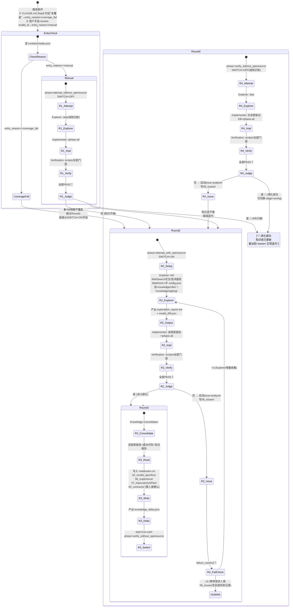
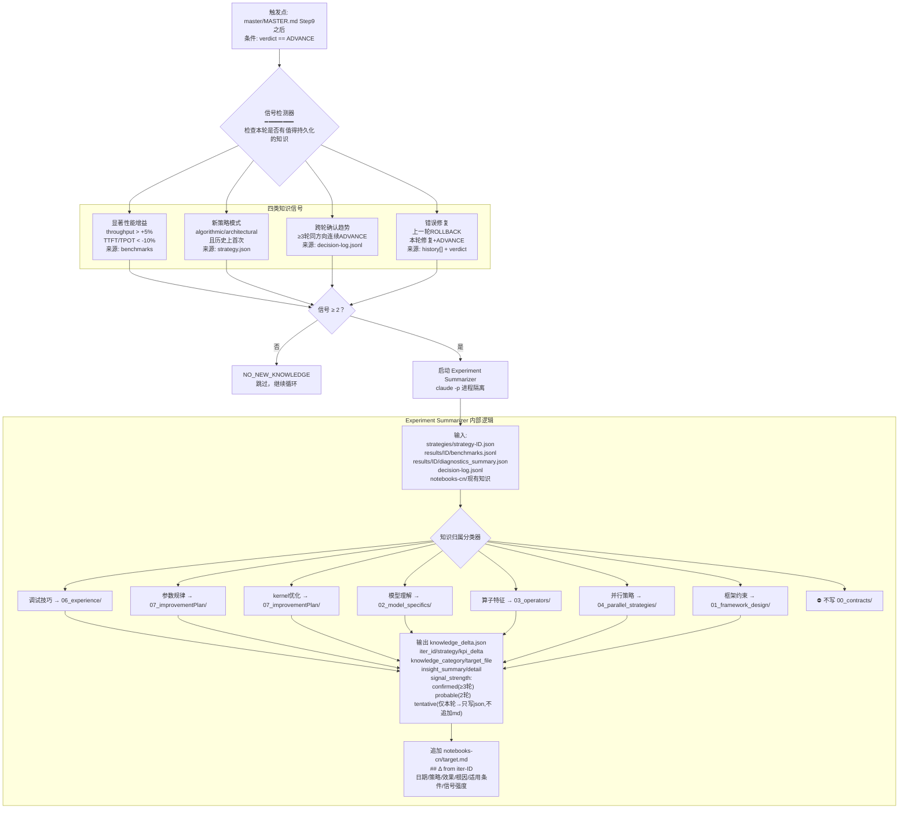
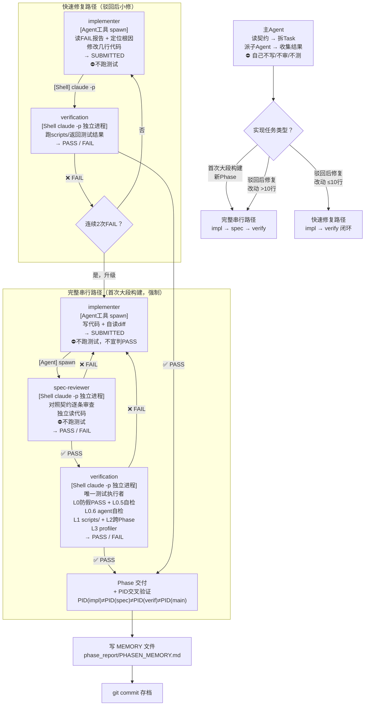
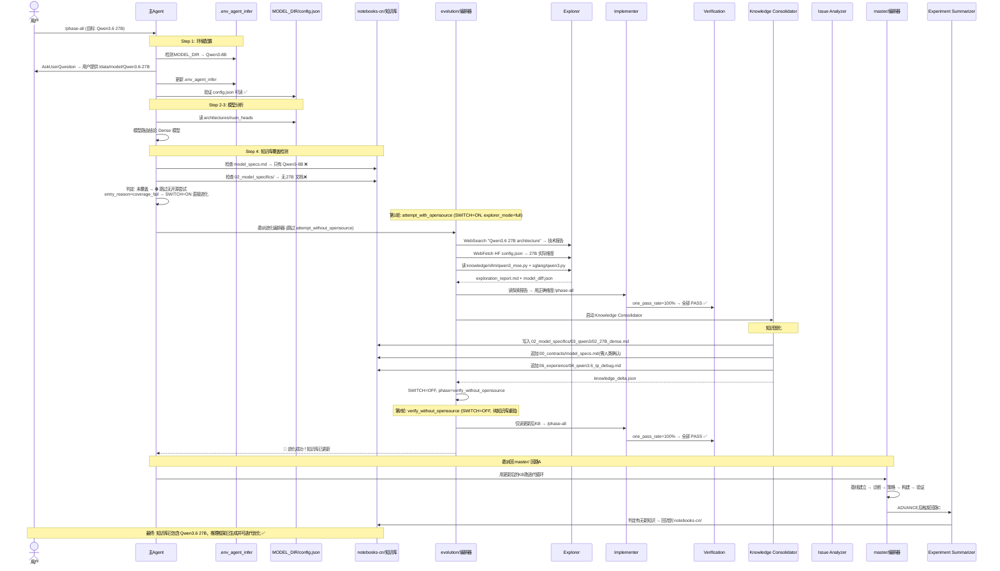
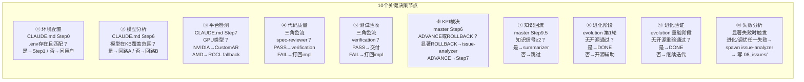
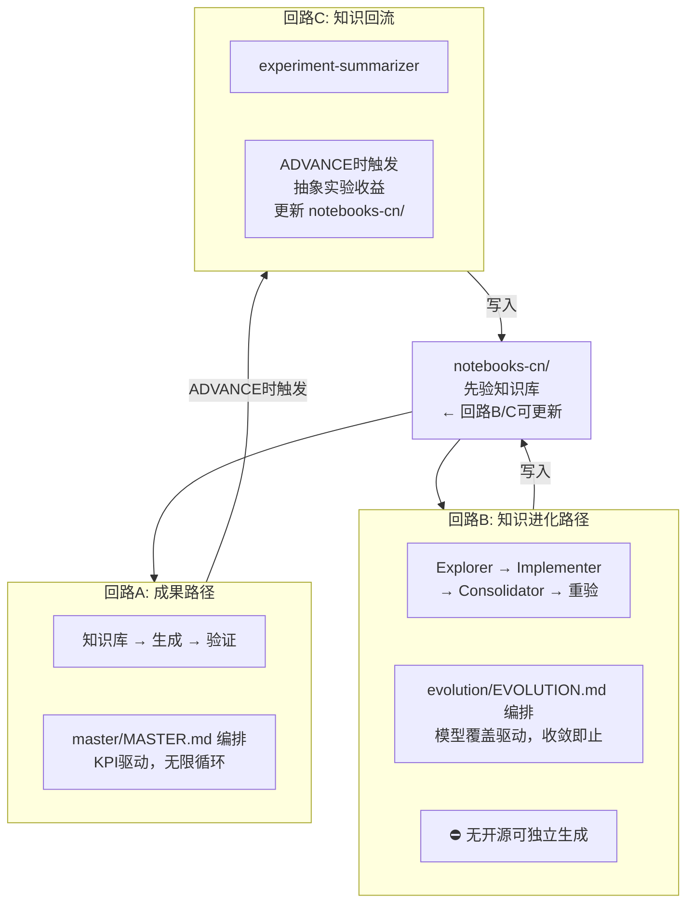

# MetaInfer v3 — 全项目流程图（Mermaid 版）

> 本文是 `PROJECT_FLOW.md` 的 Mermaid 等价转换。每个 Mermaid 图独立可渲染，LLM 可直接解析节点/边/子图关系，无需理解 ASCII art。

---

## 一、全局架构鸟瞰（四层 + 三条回路）

---

## 二、主入口决策树（CLAUDE.md 启动流程）

```mermaid
flowchart TD
    START(["用户输入<br/> /phase-all | /phase5 | /evolve model | 直接描述任务"])
    
    START --> S0["Step 0: 环境配置"]
    S0 --> S0_CHECK{".env_agent_infer<br/>存在？"}
    S0_CHECK -->|"存在"| S0_LOAD["加载环境变量"]
    S0_CHECK -->|"不存在"| S0_ASK["AskUserQuestion<br/>MODEL_DIR + PYTHON_PATH"]
    S0_LOAD --> S0_MATCH{"MODEL_DIR<br/>匹配用户目标？"}
    S0_MATCH -->|"是"| S0_VALIDATE
    S0_MATCH -->|"否"| S0_ASK
    S0_ASK --> S0_WRITE["写入 .env_agent_infer"]
    S0_WRITE --> S0_VALIDATE["验证:<br/>ls config.json<br/>python -c 'import torch'"]
    
    S0_VALIDATE --> S1["Step 1-3: 加载上下文<br/>读 00_contracts/<br/>读 AGENT_SKILL.md<br/>设置 PYTHONPATH"]
    
    S1 --> S4["Step 4-5: 模型分析<br/>读 config.json<br/>architectures/num_heads/rope_scaling"]
    S4 --> S4_OUT["输出模型路由结论<br/>Dense 或 MLA+MoE"]
    
    S4_OUT --> S6{"Step 6: 知识库覆盖检测<br/>━━━━━━━━━━━━━<br/>① model_specs.md 有该模型参数？<br/>② 02_model_specifics/ 有该模型文档？<br/>③ 00_contracts/ 架构契约就绪？"}
    
    S6 -->|"三项全满足 ✅"| ROUTE_AC["进入回路 A+C<br/>直接构建"]
    S6 -->|"任一不满足 ❌"| ROUTE_B["⛔ 进入回路 B: 进化路径<br/>entry_reason=coverage_fail<br/>跳过无开源尝试<br/>直接从 SWITCH=ON 开始"]
    
    ROUTE_B --> EVO_CHECK{"进化成功？<br/>知识库已更新"}
    EVO_CHECK -->|"是"| ROUTE_AC
    EVO_CHECK -->|"否"| ROUTE_B
    
    ROUTE_AC --> S7["Step 7: 平台自动检测<br/>torch.cuda.get_device_name(0)"]
    S7 --> S7_OUT["NVIDIA → CustomAR+NCCL<br/>AMD → RCCL fallback<br/>DCU → comm fallback"]
    
    S7_OUT --> S8["Step 8: MEMORY 回溯<br/>读 phase_report/PHASEN_MEMORY.md<br/>重建前序上下文"]
    
    S8 --> BUILD["进入构建/迭代流程<br/>见下方回路详图"]
```

---

## 三、回路 A（成果路径）：性能迭代循环

---

## 四、回路 B（知识进化路径）：新模型学习循环

---

## 五、回路 C（知识回流）：实验经验 → 知识库

---

## 六、三角色对抗协作流（双轨制 + 进程隔离标注）

**标注约定**：`-->>` 虚线 = Agent 工具 spawn，`==>` 粗线 = Shell `claude -p` 独立进程。

---

## 七、完整示例：Qwen3.6 27B 时序图

---

## 八、目录文件热力图（树形结构）

```mermaid
graph TD
    ROOT["metainferv3/"]
    
    ROOT --> CLAUDE["📄 CLAUDE.md<br/>🔴 P0 入口文件"]
    ROOT --> SKILL["📄 AGENT_SKILL.md<br/>🔴 P0 执行SOP+12条铁律"]
    ROOT --> FLOW["📄 PROJECT_FLOW.md<br/>🟢 P2 全局流程图"]
    ROOT --> ENV["📄 .env_agent_infer<br/>🟡 P1 环境变量(gitignore)"]
    ROOT --> GITIGNORE["📄 .gitignore<br/>🟢 P2"]
    
    ROOT --> NC["📁 notebooks-cn/<br/>🔴 P0 先验知识库"]
    NC --> NC_CONTRACTS["00_contracts/<br/>🔴 P0 11个API契约<br/>人类写, B/C慎改"]
    NC --> NC_OVERVIEW["00_overview/<br/>🟡 P1 项目总览"]
    NC --> NC_FW["01_framework_design/<br/>🟡 P1 框架设计"]
    NC --> NC_MODEL["02_model_specifics/<br/>🟡 P1 B/C可扩写"]
    NC --> NC_OPS["03_operators/<br/>🟡 P1 B/C可扩写"]
    NC --> NC_PARALLEL["04_parallel_strategies/<br/>🟡 P1 B/C可扩写"]
    NC --> NC_SERVICE["05_inference_service/<br/>🟢 P2"]
    NC --> NC_EXP["06_experience/<br/>🟡 P1 C自动追加"]
    NC --> NC_IMP["07_improvementPlan/<br/>🟡 P1 C自动追加"]
    NC --> NC_ISSUES["08_issues/<br/>🟡 P1 失败经验库<br/>进化+调优积累"]
    
    ROOT --> DOTCLAUDE["📁 .claude/"]
    DOTCLAUDE --> ROLES["roles/<br/>🔴 P0 7个Agent角色"]
    ROLES --> R_IMPL["implementer-inference.md"]
    ROLES --> R_SPEC["spec-reviewer-inference.md"]
    ROLES --> R_VERIF["verification-inference.md"]
    ROLES --> R_SUMM["experiment-summarizer.md<br/>🟢 P2 回路C"]
    ROLES --> R_EXPL["explorer.md<br/>🟢 P2 回路B"]
    ROLES --> R_CONS["knowledge-consolidator.md<br/>🟢 P2 回路B"]
    ROLES --> R_ISSUE["issue-analyzer.md<br/>🟢 P2 失败分析"]
    DOTCLAUDE --> SKILLS["skills/<br/>🟡 P1 Phase触发词"]
    
    ROOT --> MASTER_DIR["📁 master/<br/>🔴 P0 回路A编排器"]
    MASTER_DIR --> M_MASTER["MASTER.md"]
    MASTER_DIR --> M_STATE["state.json"]
    MASTER_DIR --> M_LOG["decision-log.jsonl"]
    MASTER_DIR --> M_STRATEGIES["strategies/"]
    MASTER_DIR --> M_RESULTS["results/"]
    MASTER_DIR --> M_SCRIPTS["scripts/call-sub-agent.sh"]
    
    ROOT --> EVO_DIR["📁 evolution/<br/>🟢 P2 回路B编排器"]
    EVO_DIR --> E_EVO["EVOLUTION.md"]
    EVO_DIR --> E_STATE["state.json"]
    EVO_DIR --> E_LOG["decision-log.jsonl"]
    EVO_DIR --> E_STRATEGIES["strategies/"]
    EVO_DIR --> E_RESULTS["results/"]
    EVO_DIR --> E_SCRIPTS["scripts/call-evo-agent.sh"]
    
    ROOT --> ENGINE["📁 engine/<br/>🔴 P0 生成产物:推理框架"]
    ENGINE --> E_KERNELS["kernels/"]
    ENGINE --> E_MODELS["models/"]
    ENGINE --> E_FW["framework/"]
    ENGINE --> E_TP["tp_layers/"]
    ENGINE --> E_SC["self_check.py"]
    
    ROOT --> LLM["📄 llm_engine.py<br/>🔴 P0 引擎主循环"]
    ROOT --> OAI["📄 openai_tp_server.py<br/>🔴 P0 OpenAI API服务"]
    ROOT --> SCRIPTS_DIR["📁 scripts/<br/>🔴 P0 28个测试合约(只读)"]
    ROOT --> REPORTS["📁 phase_report/<br/>🟡 P1 审查报告(gitignore)"]
    ROOT --> KNOWLEDGE["📁 knowledge/<br/>🟢 P2 开源代码缓存(gitignore)"]
    ROOT --> ITERATIONS["📁 iterations/<br/>🟢 P2 迭代工作区(gitignore)"]
```

---

## 九、关键决策节点速查

---

## 附录：三条回路总览

---

> **LLM 解析提示**：每个 Mermaid 代码块都是独立、自包含的图。LLM 解析时关注 `subgraph`（子系统边界）、`-->|"标签"|`（带语义的边）、`{}`（决策菱形节点）即可重建完整的项目拓扑。
