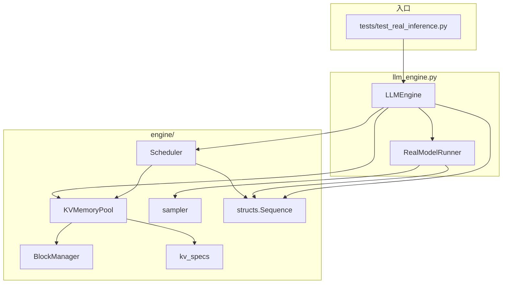
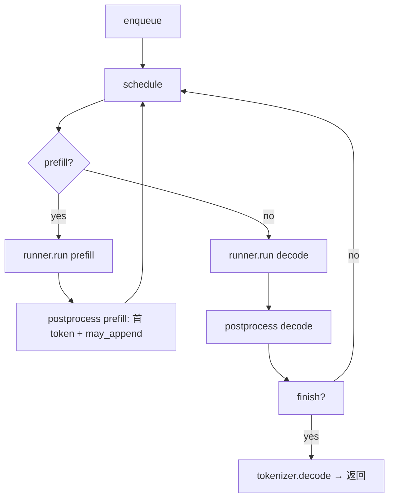

# 真实推理简易框架说明（`llm_engine.py` + `engine/` + `tests/test_real_inference.py`）

本文档描述 **meta-infer** 根目录下「调度 + KVMemoryPool（分页 + 物理占位）+ 真实 HF 模型前向 + 采样」闭环，对应 `llm_engine.py`、`engine/` 包与 `tests/test_real_inference.py`。

---

## 1. 设计目标与范围

| 目标 | 说明 |
|------|------|
| 对外接口 | `LLMEngine.generate(prompt, max_new_tokens, ...)`，支持单条字符串或多条列表 |
| 真实模型 | `transformers.AutoModelForCausalLM` + `AutoTokenizer`，本地权重目录（默认 `MODEL_DIR`） |
| 框架骨架 | `Scheduler` + `KVMemoryPool`（内嵌 `BlockManager`）+ `Sequence` + `sampler.sample_next_tokens` |
| 测试 | `test_real_inference.py` 构造 `LLMEngine`，多条 `PROMPTS`，断言条数与非空文本 |

**实现要点**：

- **HF 前向**：`RealModelRunner` 使用 **`use_cache=False`** 整段重算（规避部分远程 `modeling_deepseek` 与 `DynamicCache` 组合问题）；**物理 KV 张量未接入** `model.forward`。
- **KVMemoryPool**：`engine/block_manager.py` 的 **分页 + blake2b 链式块哈希 + `hash_to_block_id` 前缀命中 + `ref_count`**；`engine/kv_specs.py` 按 HF `config` 计算 **MLA 展开后 K/V 每 token 字节**；GPU 上可选 **一维占位张量** `kv_storage`（逻辑容量与块预算对齐，实际元素数 capped，见第 4 节）。
- **调度**：Prefill 优先；块不足时 **排队等待**，**不抢占**（无 `PREEMPTED` 状态）。

---

## 2. 组件从属、依赖与调用关系

### 2.1 从属关系（谁包含谁）

| 上层 | 直接包含 / 委托 |
|------|------------------|
| **LLMEngine** | `RealModelRunner`、`KVMemoryPool`、`Scheduler`；构造时先建 Runner（加载模型），再 `_estimate_kv_blocks()`，再建池与调度器 |
| **KVMemoryPool** | 内部 **`BlockManager`**（`self._manager`）；可选 **`kv_storage`** 占位张量 |
| **BlockManager** | `blocks: list[Block]`、`free_block_ids`、`hash_to_block_id`；不依赖上层 |
| **Scheduler** | 仅依赖 **`KVMemoryPool`** 的公开 API（`can_allocate`、`allocate_for_sequence`、`can_append_one_more`、`ensure_capacity_for_sequence`），不直接引用 `BlockManager` |
| **RealModelRunner** | 独立持有 HF `model` / `tokenizer`；仅通过 `run(seqs, ...)` 接收 **`Sequence`** 列表，不读 `block_table` |

### 2.2 依赖图（模块级）

### 2.3 运行时调用链（`generate` 一步）

1. **LLMEngine.generate** → `_enqueue`：`tokenizer.encode` → 构造 `Sequence` → `scheduler.add_request`。
2. **LLMEngine** → `scheduler.schedule()` → `(batch, is_prefill)`。
3. **Prefill 分支**：`runner.run(batch, is_prefill=True)` → `scheduler.postprocess(..., is_prefill=True, generated_tokens=first_tokens)`：写入首 token、`ensure_capacity_for_sequence`、`num_cached_tokens`、转 `RUNNING_DECODE`。
4. **Decode 分支**：`runner.run(batch, is_prefill=False)` → `postprocess(decode, next_tokens)`：`append_token` + `ensure_capacity_for_sequence` → `finish` 检查 → 可能 `memory_pool.free_sequence`。

**数据在组件间传递的形态**：

- **跨组件**：主要是 **`list[Sequence]`**（Python 对象，内含 `list[int]` token 与 `block_table`），**无**把 `kv_storage` 或 `block_table` 传给 `RealModelRunner`。
- **HF 内部**：仅 `RealModelRunner` 构造 `torch.Tensor` 并调用 `model(...)`。

---

## 3. 各组件职责速查

| 组件 | 职责 |
|------|------|
| **LLMEngine** | 设备/dtype、创建 Runner、按显存估算 `num_blocks`、构造 `KVMemoryPool` 与 `Scheduler`、驱动 `generate` 主循环、结束时 `free_sequence` |
| **RealModelRunner** | 加载 tokenizer/model；Prefill 逐条 `seq` 前向；Decode 组 batch 左 pad；`logits` → `sample_next_tokens` |
| **Scheduler** | `schedule()`：`waiting` 上 prefill（预算 `max_num_batched_tokens`、块 `can_allocate`），否则对 `running` 做 decode（`can_append_one_more`）；`postprocess` 更新 token 与块扩展 |
| **KVMemoryPool** | 委托 `BlockManager` 分配/释放块表；`ensure_capacity_for_sequence` → `may_append`；可选分配 **`kv_storage`** |
| **BlockManager** | 与 nano-vllm 类似的块分配、链式哈希前缀缓存、`ref_count` |
| **kv_specs** | `hf_deepseek_v2_kv_bytes_per_token` / `_per_block`，供池预算与日志 |

---

## 4. Token 推理生命周期（与当前代码一致）

### 4.1 Prefill 与 Decode

| 阶段 | Scheduler | Runner 输入 | postprocess |
|------|-------------|---------------|-------------|
| **Prefill** | `allocate_for_sequence` 建立 `block_table` | 每条序列 **单独** `forward`，`input_ids` 形状 **`[1, L_prompt]`** | 将 `runner` 返回的 **首个采样 token** 写入 `output_ids`，`ensure_capacity_for_sequence`，`num_cached_tokens = total_tokens`，进入 `RUNNING_DECODE` |
| **Decode** | 选中 `can_append_one_more` 的 running 序列组 batch | **左 pad** 后 `input_ids` **`[B, L_max]`**，`attention_mask` 同形 | `append_token`、`ensure_capacity_for_sequence` |

**说明**：首个进入 `output_ids` 的 token 来自 **Prefill 步的采样**（`postprocess(prefill)` 写入），其后每步 Decode 再追加；因仍用 `use_cache=False`，每步 forward 仍为**全序列重算**。

### 4.2 `generate` 主循环（简图）

---

## 5. 张量与类型规格（组件间传递）

### 5.1 `RealModelRunner` 内部（唯一产生 GPU 张量的引擎层）

令 `L` = 单条 prompt 长度（prefill），`B` = decode batch 大小，`L_max` = 该 batch 内 pad 后最大长度，`V` = `config.vocab_size`。

| 步骤 | 张量 | shape | dtype | device | 说明 |
|------|------|-------|-------|--------|------|
| Prefill（每条 seq 一次） | `input_ids` | `[1, L]` | `torch.long`（`int64`） | `self.device` | 无 `attention_mask`（单条满长有效） |
| Prefill | `out.logits` | `[1, L, V]` | 与模型 logits 一致（通常 `bf16`/`fp16` 计算图） | GPU | 取 **`out.logits[0, -1, :]`** → `[V]`，再 `unsqueeze(0)` 为 `[1, V]` 送入 `sample_next_tokens` |
| Decode | `input_ids` | `[B, L_max]` | `torch.long` | `self.device` | 左 pad，`pad_token_id` |
| Decode | `attention_mask` | `[B, L_max]` | `torch.long` | `self.device` | pad 位置 0，有效 token 1 |
| Decode | `out.logits` | `[B, L_max, V]` | 同上 | GPU | 使用 **`out.logits[:, -1, :]`** → **`[B, V]`** |
| 采样 | `sample_next_tokens` 输入 | `[B, V]` 或 `[1, V]` | 与 logits 一致传入（内部会 `.float()` 做 temperature） | GPU | 输出 **`[B]`** 或 **`[1]`** int64 CPU list |

**注意**：`Sequence` 上的 **`block_table: list[int]`**、**`num_cached_tokens: int`** 由 Scheduler / KVMemoryPool 维护；**不**作为 tensor 传入 `model`。

### 5.2 `KVMemoryPool` 物理占位（可选）

| 成员 | shape | dtype | 说明 |
|------|-------|-------|------|
| `kv_storage` | `[numel]` 一维，`numel = min(logical_numel, (512*1024**2)/elem_size)` | `dtype`（与引擎一致，如 `bfloat16`） | `cuda` 上预分配；**未**写入、**未**传给 HF；仅预留显存与逻辑容量对齐 |

逻辑字节数：`num_blocks * block_size * kv_bytes_per_token`（见 `kv_specs`），与 `BlockManager` 块数一致。

### 5.3 `sampler.sample_next_tokens`

- **输入**：`logits`，**至少 2D**：`[batch, vocab]`。
- **输出**：`torch.Tensor`，**1D** `batch` 个 token id（`long`），在 `llm_engine` 中转为 Python `list[int]`。

---

## 6. KV 预算与 `kv_specs`（`engine/kv_specs.py`）

与 HF DeepSeek-V2 MLA **materialized** K/V 一致的每 token 体积估算：

- 每层：`num_attention_heads × (q_head_dim + v_head_dim) × elem_size`  
  - `q_head_dim = qk_nope_head_dim + qk_rope_head_dim`
- 总：`num_hidden_layers × 每层`

`bytes_per_block = bytes_per_token × block_size`；`KVMemoryPool.estimate_num_blocks` 使用 `free_bytes`、`reserve_bytes`、`mem_utilization` 得到 `num_blocks`。

---

## 7. 测试如何串联

`tests/test_real_inference.py`：

1. 模块级 `PROMPTS`。
2. `LLMEngine(...)` 传入 `block_size`、`mem_utilization`、`reserve_bytes`、`max_num_seqs`、`max_num_batched_tokens`。
3. `generate(PROMPTS, max_new_tokens=32, temperature=0.0)`。
4. 断言条数与非空字符串。

无 CUDA 时 `@pytest.mark.skipif` 跳过。

---

## 8. 已知限制与演进方向

1. **无增量 KV 前向**：`use_cache=False`，计算量随序列长度线性增长；若改为 `use_cache=True`，需与 `block_table` / 占位或 paged 布局对齐写入路径。
2. **Prefill 逐条 forward**：batch 较大时可通过合并 prefill 优化（需与 mask/块分配一致）。
3. **`kv_storage`** 为占位，**未**与 attention 层绑定；接入真实 paged KV 时可按层 `view` 并接自定义 kernel。

---

## 9. 相关源文件索引

| 路径 | 作用 |
|------|------|
| `meta-infer/llm_engine.py` | `LLMEngine`、`RealModelRunner`、`MODEL_DIR` |
| `meta-infer/engine/scheduler.py` | Prefill/Decode 调度（无抢占） |
| `meta-infer/engine/memory_pool.py` | `KVMemoryPool`、占位张量、块数估算入口 |
| `meta-infer/engine/block_manager.py` | `BlockManager`、块哈希与引用计数 |
| `meta-infer/engine/kv_specs.py` | MLA K/V 每 token / 每 block 字节数 |
| `meta-infer/engine/structs.py` | `Sequence`、`SequenceStatus` |
| `meta-infer/engine/sampler.py` | `sample_next_tokens` |
| `meta-infer/tests/test_real_inference.py` | 端到端 GPU 测试 |

---

*文档版本：与当前仓库 `llm_engine.py`、`engine/*`、`test_real_inference.py` 同步；若 Runner 或池接入真实 KV，请更新第 5、8 节。*
